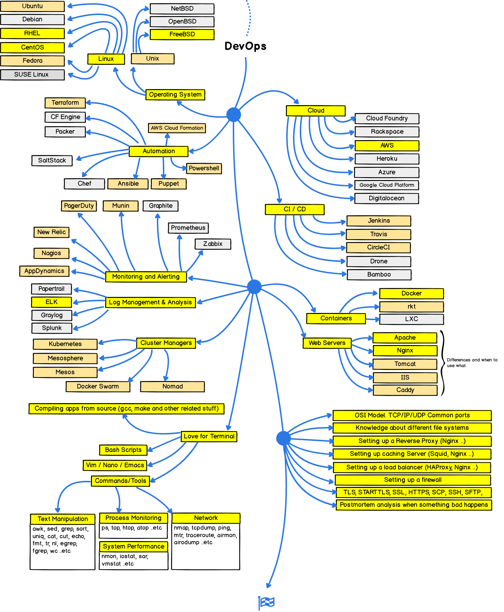

# Home

Welcome on my personnal documentation.

Checkout my blog on [GitCommit](https://gitcommit.fr)

## Configuration

**Install my configuration**

```bash
wget -O - https://ls.gitcommit.fr | bash -s [option] $USER
```

<u>Available options:</u>

- minimal (vim)
- shell (zsh)
- server (modified prompt with red warning)
- docker
- ansible
- full (minimal && shell)


[Go to Github project](https://github.com/victorboissiere/lifesaver)

## What is DevOps?


