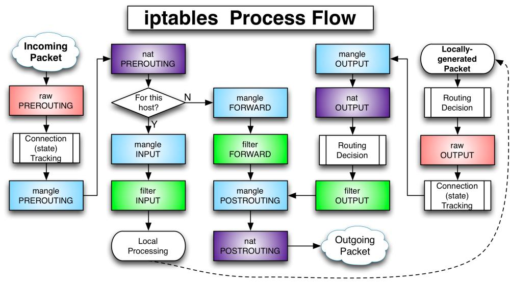

List all chains and policies with `iptables -L -n`

Default table: `filter`.

- `-t [table]`: Append
- `-A [chain]`: Append
- `-S [chain]`: List rules
- `-I [chain] [position]`: Insert rule to specific location (default pos 1)
- `-P [chain] [target]`: Change policy (here target: ACCEPT,DROP)
- `-D [rule_position]`: Delete (`iptables -L -n --line-numbers`)
- `-R [rule_position]`: Replace
- `-i [input_inteface]`
- `-o [input_inteface]`
- `-j [target]`: Jump to target
- `-p [protocol]`
- `--dport [port]`

Default rules and policies are located in `/etc/iptables/iptables.rules`.



### Examples

**Update default policy**

```bash
iptables -P INPUT DROP
```

**Source nat**

```bash
/sbin/iptables -t nat -I POSTROUTING -s 10.8.0.0/24 -d 172.31.0.0/16 -j SNAT --to-source 172.32.0.10
```

**List rules**

```bash
sudo iptables -t nat -S POSTROUTING
```

**Masquerade with OpenVPN** *tap0*

```bash
/sbin/iptables -t nat -A POSTROUTING -o tap0 -j MASQUERADE
/sbin/iptables -t nat -A POSTROUTING -o eth0 -j MASQUERADE
/sbin/iptables -A FORWARD -i eth0 -o tap0 -j ACCEPT
/sbin/iptables -A FORWARD -i tap0 -o eth0 -m state --state RELATED,ESTABLISHED -j ACCEPT
```
